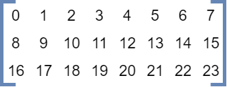
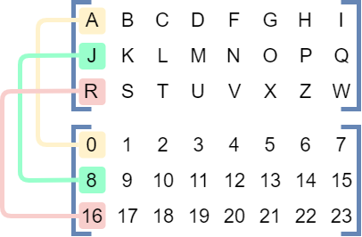
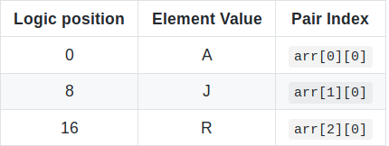
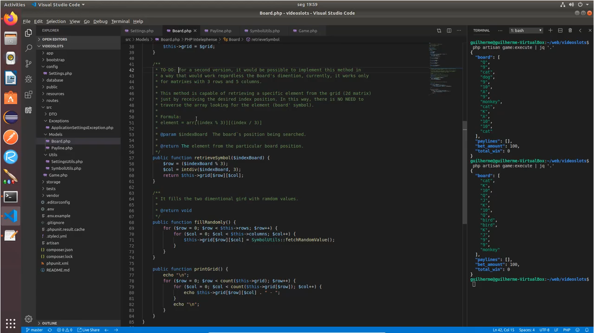

# The anti-traversing 2D Array formula

<div align="center">
  <a href="https://www.youtube.com/watch?v=kQBwtTqAvfA"></a>
</div>

Recently, I've faced a specific challenge related to boards (2D Arrays). Take the following bidimensional array as the values of each element on the board:

<p align="center">
  
</p>

What if this matrix has specific logic for numbering each symbol on the board:

<p align="center">
  
</p>


By overlaying both matrices we would have this:



Each integer value `[0 ... 23]` represents a value on the board.


	
The same logic can be applied to any of the elements.

<br>

---

> ## *Wait! How could we retrieve the value of any element from the board ( board[row][col] ) based only on the 'integer logical number' of each element on the 2d Matrix?*

## The traversing solution | `O(n²) complexity`

Usually, our first thought is to traverse the 2D matrix until reach the expected 'logical number', such as in the code below:

```java
/*
 * A 'BAD' WAY...
 */
public class Main {

  private static char retrieveElement(char[][] arr, int logicPosition) {
    for(int i = 0, count = 0; i < arr.length; i++) {
      for(int j = 0; j <  arr[i].length; j++, count++) {
        if(count == logicPosition) {
          return arr[i][j];
        }
      }
    }
    return 0;
  }

  public static void main(String... args) {

    char[][] board = {
        {'A', 'B', 'C', 'D', 'F', 'G', 'H', 'I'},
        {'J', 'K', 'L', 'M', 'N', 'O', 'P', 'Q'},
        {'R', 'S', 'T', 'U', 'V', 'X', 'Z', 'W'}
    };

    System.out.println(retrieveElement(board, 0));
    System.out.println(retrieveElement(board, 8));
    System.out.println(retrieveElement(board, 16));
  }

}
```

The output result is:

```json
A
J
R
```

The output is correct, but definitely, it isn't either performative or an elegant way of retrieving the board element based on the logic that enumerates each element on the two-dimensional array. The cost of the operation grows by the relation between the rows and columns in the target array.

So, I've decided to analyze the relation of the 'integer logical position' vs the 'row and column' positioning of each element on the 2D Array.

> ## *What would be the formula to retrieve any element from the board without iterating over the matrix itself?*

Based on the logic that enumerates each element on the board that was previously presented in this post, I've ended up in the following formula:

<p align="center">
  
</p>

### Quick Formula explanation

- The **Elem** represents the value placed on that particular logical position, it's the value that we are looking for, without the need to iterate over the array;
- The **X** represents the coordinate, the integer logical position of each element on the bidimensional array. In our example, it is in a range of 0 till 23.
- The **arr[0].length** represents the number of columns presented on the bidimensional array. In our example, it's 8.
- The **Row** is the simple division between the logical position *(x)* and the array's column length.
- The **Column** is the modular result between the logical position *(x)* and the array's column length.

## The formula solution | `O(1) complexity`

By applying the formula above, we are going to access the bidimensional elements via their index pair *[row][col]*. This will decrease the complexity to be a **constant-time** *O(1)*. See the code below:

```java
public class Main {

  private static char retrieveElement(char[][] arr, int logicPosition) {
    int columnsLength = arr[0].length;
    int row = logicPosition / columnsLength;
    int col = logicPosition % columnsLength;
    return arr[row][col];
  }

  public static void main(String... args) {

    char[][] board = {
        {'A', 'B', 'C', 'D', 'F', 'G', 'H', 'I'},
        {'J', 'K', 'L', 'M', 'N', 'O', 'P', 'Q'},
        {'R', 'S', 'T', 'U', 'V', 'X', 'Z', 'W'}
    };

    System.out.println(retrieveElement(board, 0));
    System.out.println(retrieveElement(board, 8));
    System.out.println(retrieveElement(board, 16));
  }
 }
 ```
 
 The output result is:

```json
A
J
R
```

The output is correct and at this time the code seems much cleaner and definitely more efficient. This formula is applicable to any bidimensional matrix.

### Practical 'Real-life' usage example

<div align="center">
  <a href="https://www.youtube.com/watch?v=6fbq3k48RvQ"></a>
</div>


### Conclusion

For several cases, such as enterprise applications, performance and scalability are important aspects of the code implementation, hopefully, this post will have practical appliance in some real-life applications. As we know, there is no 'one size fits all' in Information Technology(IT), the formula will depend on the `logic numbering` being used to enumerate each element on the bidimensional array. The goal here is to share the idea of accessing elements from a two-dimensional array without necessarily traversing it. This can increate a lot the performance of your implementation. 

It's clear that I'm not mathematical, so I count on you to sharing articles, books and also your knowledge with me by posting your comments and notes down below or contacting me directly.

#### Thank you!
 